# 直播回放自动化分析系统架构

## 目标

系统拆分为 5 个核心模块，分别负责素材准备、音频转写、弹幕采集、数据对齐和 LLM 分析：

- `Downloader`: 准备本地或远端素材。
- `Transcriber`: 提取音频并执行 ASR。
- `LiveDanmakuCollector`: 抓取直播间弹幕并落盘。
- `DataAligner`: 对齐主播话术、人数曲线和弹幕时间线。
- `AgentAnalyst`: 将锚点上下文发给 `cli_proxy` 做归因判断。

设计原则是“采集”和“分析”分离。弹幕采集只负责拿到标准化原始数据，后续统计和 Agent 推理统一由 `DataAligner` 与 `PostLiveAnalyst` 完成。

## 类图

```mermaid
classDiagram
    class AnalysisPipeline {
        +run(inputs: AnalysisInputs) AnalysisArtifacts
    }

    class AnalysisInputs {
        +occupant_history_path: Path
        +replay_video_path: Path
        +danmaku_path: Path | None
        +room_id: str | None
        +workspace_dir: Path
    }

    class Downloader {
        <<interface>>
        +prepare_inputs(inputs: AnalysisInputs) AnalysisInputs
    }

    class Transcriber {
        <<interface>>
        +extract_audio_async(video_path: Path, audio_path: Path) Awaitable~Path~
        +transcribe(audio_path: Path) list~TranscriptSegment~
    }

    class DanmakuSourceAdapter {
        <<interface>>
        +fetch_messages(room_id: str, cursor: str | None) tuple~list[DanmakuMessage], str | None~
    }

    class LiveDanmakuCollector {
        +run(stop_event: asyncio.Event) Path
    }

    class DataAligner {
        +load_occupancy_history(csv_path: Path) DataFrame
        +load_danmaku_history(path: Path) DataFrame
        +align_segments(segments, occupancy_df, danmaku_df, anchors) list~AlignedSegment~
        +detect_anchor_events(occupancy_df, config) list~AnchorEvent~
        +build_timeline(segments, occupancy_df, danmaku_df, config) DetailedTimeline
    }

    class AgentAnalyst {
        <<interface>>
        +analyze_anchor(anchor_payload: AnchorAnalysisInput) AnchorAnalysisResult
    }

    class PostLiveAnalyst {
        +build_prompt(anchor_payload) str
        +analyze_anchor(anchor_payload) AnchorAnalysisResult
    }

    class TranscriptSegment {
        +start: float
        +end: float
        +text: str
    }

    class DanmakuMessage {
        +timestamp: float
        +text: str
        +user_id: str | None
        +user_name: str | None
        +sentiment_score: float | None
    }

    class DanmakuStats {
        +message_count: int
        +unique_user_count: int
        +avg_sentiment: float | None
        +positive_count: int
        +negative_count: int
        +neutral_count: int
        +sample_messages: list~str~
    }

    class AlignedSegment {
        +segment_id: str
        +start: float
        +end: float
        +text: str
        +occupancy: OccupancyStats
        +danmaku: DanmakuStats | None
        +nearby_anchor_ids: list~str~
    }

    class AnchorEvent {
        +anchor_id: str
        +timestamp: float
        +direction: str
        +pct_change: float
        +abs_change: int
        +baseline_count: int
        +target_count: int
    }

    AnalysisPipeline --> Downloader
    AnalysisPipeline --> Transcriber
    AnalysisPipeline --> LiveDanmakuCollector
    AnalysisPipeline --> DataAligner
    AnalysisPipeline --> AgentAnalyst
    LiveDanmakuCollector --> DanmakuSourceAdapter
    LiveDanmakuCollector --> DanmakuMessage
    DataAligner --> TranscriptSegment
    DataAligner --> DanmakuMessage
    DataAligner --> DanmakuStats
    DataAligner --> AlignedSegment
    DataAligner --> AnchorEvent
    PostLiveAnalyst ..|> AgentAnalyst
```

## 关键数据文件

- `occupant_history.csv`: 每秒在线人数。
- `replay.mp4`: 直播回放视频。
- `voicetrack.wav`: 由 `ffmpeg` 异步提取的 16kHz 单声道音频。
- `transcript.json`: `faster-whisper` 输出的带 `start/end` 时间戳转写结果。
- `danmaku_history.jsonl`: 实时抓取的弹幕流，每行一条 `DanmakuMessage`。

## 数据流

1. `Downloader` 准备回放视频、人数历史和可选的直播间参数。
2. `LiveDanmakuCollector` 通过 `DanmakuSourceAdapter` 持续抓取直播间弹幕，实时写入 `danmaku_history.jsonl`。
3. `Transcriber` 异步调用 `ffmpeg` 提取音频，再由 `faster-whisper` 输出结构化字幕。
4. `DataAligner` 读取人数、ASR 和弹幕，将每个 ASR 分段映射到同一时间窗内的人数统计和弹幕统计。
5. `DataAligner` 检测 1 分钟窗口内超过阈值的人数激增/骤降锚点。
6. `PostLiveAnalyst` 将锚点前后主播话术、人数波动和弹幕情感摘要发送给 `cli_proxy`，判断更可能是货品、话术还是投流驱动。
7. `SummaryReporter` 输出 `summary.md` 和 `detailed_timeline.json`。

## 解耦约束

- `LiveDanmakuCollector` 不关心后续分析逻辑，只负责抓取和标准落盘。
- `DataAligner` 不关心弹幕来源，只要求输入是标准化 DataFrame、JSONL 或 dataclass 列表。
- `AgentAnalyst` 不直接读 CSV、JSONL 或视频文件，只消费对齐后的锚点上下文。
- `Transcriber` 与弹幕抓取完全独立，任一失败不阻断另一条链路。

## 失败降级

- `ffmpeg` 失败: 跳过 ASR，但保留人数和弹幕分析。
- `faster-whisper` 失败: `DataAligner` 仍可输出人数锚点和弹幕窗口统计。
- 弹幕抓取失败: `DataAligner` 返回空弹幕统计，不阻断人数与语音分析。
- `cli_proxy` 失败: 保留原始锚点数据，并把锚点分析状态标记为 `pending`。
